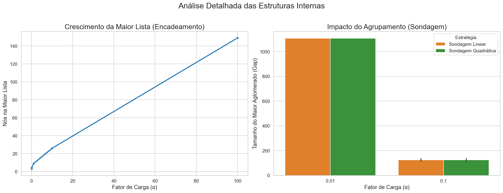

# Análise de Desempenho de Estratégias de Tratamento de Colisão em Tabelas Hash

## Resumo

Esse relatório apresenta uma análise de desempenho comparativa entre três estratégias de tratamento de colisão em tabelas hash:
- **Encadeamento Separado**
- **Sondagem Linear**
- **Sondagem Quadrática**

Conclusão inicial:

- O desempenho se degrada drasticamente em fatores de carga altos
- A Sondagem Linear sofre um colapso de performance devido ao agrupamento primário
- O Encadeamento Separado se mostra a abordagem mais robusta e previsível, mantendo uma degradação de desempenho linear e tamanho ilimitado, porém em média, mas lenta que as outras

## Objetivo

Motivação de escolhas: 
- Encadeamento Separado (tamanho ilimitado, consistente e previsível)
- Sondagem Linear (escolhido pela implementação comum e objetiva)
- Sondagem Quadrática. (escolhido pois busca resolver exatamente um problema relacionado a sondagem linear, o agrupamento primário)

### Métricas de Avaliação
- Tempo de inserção
- Tempo de busca
- Número total de colisões

Parâmetros do Experimento
Função Hash Primária: Para todas as estratégias, foi utilizada a função do Método da Divisão: h(k) = k % M, onde k é a chave (código do registro) e M é o tamanho do vetor.

Tamanhos da Tabela (Vetor M): 100.000, 1.000.000 e 10.000.000 posições.

Tamanhos dos Conjuntos de Dados (N): 100.000, 1.000.000 e 10.000.000 registros.

Fator de Carga (α=N/M): As combinações de M e N foram escolhidas para produzir fatores de carga variados, de muito baixo (0.01) a muito alto (1.0), a fim de testar os algoritmos em diferentes casos.

Geração de Dados: Foi utilizada uma seed fixa (42L) para o gerador de números aleatórios, para que a comparação entre as implementações seja mais justa. 

## Funcionamento das implementações

### Encadeamento
- **Implementação**: Utiliza listas encadeadas em cada posição do vetor para armazenar colisões
- **Vantagem**: Performance consistente e previsível mesmo com alta taxa de ocupação
- **Desvantagem**: Maior consumo de memória devido às estruturas de lista

### Sondagem Linear
- **Implementação**: Em caso de colisão, busca próxima posição livre sequencialmente (i+1, i+2, ...)
- **Vantagem**: Simplicidade de implementação e uso de memória limitada
- **Desvantagem**: Sofre com agrupamento primário

### Sondagem Quadrática
- **Implementação**: Busca posições livres usando incrementos quadráticos (i+1², i+2², ...)
- **Vantagem**: Evita agrupamento primário, bom desempenho em taxas médias
- **Desvantagem**: Pode sofrer com agrupamento secundário

## Parâmetros do Experimento

## Análise Comparativa

1. **Fator de Carga Baixo (α <= 0.01)**
   - Sondagem Linear e Quadrática apresentam desempenho similar e eficiente
   - Encadeamento Separado mostra performance inferior devido ao overhead das estruturas de lista

2. **Fator de Carga Médio (0.1 <= α)**
   - Sondagem Quadrática mantém performance superior por evitar agrupamentos
   - Sondagem Linear começa a degradar devido ao agrupamento primário
   - Encadeamento Separado mantém crescimento linear de tempo

3. **Fator de Carga Alto (α = 1)**
   - Métodos de sondagem atingem limite de capacidade
   - Encadeamento Separado continua operacional, sendo a única opção viável
   - Demonstra o trade-off entre eficiência em baixa carga vs funcionalidade em alta carga

1. **Fator de Carga Baixo (α = 0.01)**
   - Número de colisões similar entre todas as implementações
   - Comportamento esperado devido à baixa probabilidade de colisões

2. **Fator de Carga Médio (α = 0.1)**
   - Encadeamento Separado apresenta menor número de colisões
   - Vantagem atribuída ao armazenamento em lista sem ocupar novos índices
   - Sondagem Linear começa a mostrar aumento nas colisões devido ao agrupamento primário
   - Provavelmente não é extremamente perceptível a diferença entre linear e quadrática nesse caso pois a quadrática também causa agrupamento mais tarde, porém em outra região da tabela.

3. **Fator de Carga ALto (α = 1.0)**
   - Apenas Encadeamento Separado permanece funcional
   - Demonstra a limitação fundamental das técnicas de sondagem
   - Evidencia o benefício da capacidade ilimitada do encadeamento separado

**Análise dos Gráficos de Performance vs. Fator de Carga:**

1. **Performance do Encadeamento Separado**
   - Degradação progressiva do desempenho com aumento do fator de carga
   - Causa: Maior número de elementos por lista encadeada
   - Impacto: Aumento do tempo necessário para percorrer as listas em cada posição
   - Comportamento esperado devido à natureza das listas encadeadas

2. **Análise de Gaps nas Sondagens**
   - Fator de carga relativamente baixo resulta em diferenças sutis
   - Sondagem Quadrática apresenta leve vantagem na distribuição de gaps
   - Menor formação de aglomerados devido ao padrão de saltos quadráticos
   - Confirma a eficácia da sondagem quadrática na prevenção de agrupamento primário